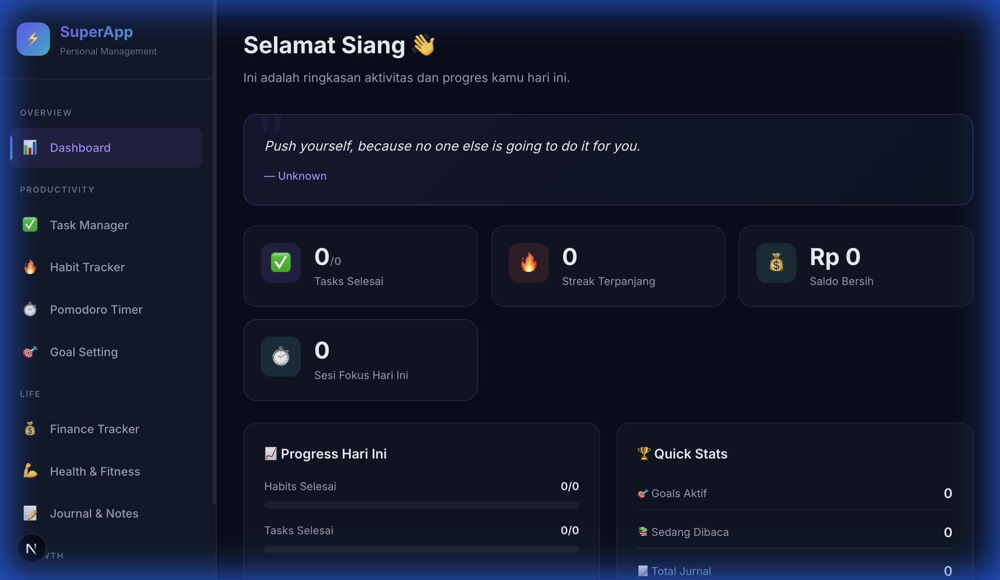

# SuperApp — Personal Management Platform

SuperApp is a comprehensive, all-in-one personal management solution designed to enhance productivity and organize daily life. Built with **Next.js 14**, it combines task management, habit tracking, financial monitoring, and gamification elements into a single, cohesive interface.

## 🚀 Overview
**SuperApp** is conceived with a "focus-first" philosophy, featuring a premium dark-mode UI infused with modern glassmorphism and smooth micro-animations. 

Designed as an MVP (Minimum Viable Product) and a personal utility, it currently operates **entirely client-side for absolute privacy**. All your tasks, financial records, and journal entries are instantly saved to your browser's `localStorage`, meaning the app works lightening-fast and is fully functional even offline. 



### 💡 Why SuperApp?
Most productivity apps lock your data behind subscriptions or require constant internet access. SuperApp flips this by giving you:
- **Zero Latency**: Everything saves instantly to your device.
- **No Vendor Lock-in**: Full JSON/CSV export capabilities for all your data.
- **Built-in Gamification**: A reward mechanism that actually makes you want to complete your chores.

## ✨ Key Features

### Productivity
- **Dashboard**: Unified view of daily progress, XP levels, and quick stats.
- **Task Manager**: Kanban-style or list-view task management with priority levels.
- **Habit Tracker**: Track daily streaks and build consistency with visual progress bars.
- **Pomodoro Timer**: Customizable timer with focus/break modes, persistent counting, and screen wake lock.
- **Goal Setting**: Long-term goal tracking with milestone breakdowns.

### Life Management
- **Finance Tracker**: Record income/expenses, visualize spending with charts, and export reports to CSV.
- **Journal & Notes**: Rich-text editor for daily reflections and note-taking.
- **Reading List**: Track books, reading progress, and ratings.
- **Health & Fitness**: Monitor water intake, sleep schedules, and workout logs.

### System & Customization
- **Gamification & Leveling**: Earn XP (Experience Points) for every task completed or Pomodoro session finished. Level up your profile, unlock dynamically generated Daily Roasts (AI-like motivational feedback), and view your Weekly Report Cards.
- **Cloud Sync (Supabase / JSONBlob)**: Optional semi-manual cloud backup using dynamic Sync IDs. You can push your `localStorage` to the cloud and pull it onto another device using a unique `SA-XXXXXX` code.
- **Custom Branding**: Personalize the app Name, Tagline, and Avatar Icon via the Settings menu. The sidebar and browser title will update dynamically.
- **PWA Ready**: Optimized for installation on mobile and desktop devices. Runs like a native app without the app store overhead.

## 🛠 Type Stack

- **Framework**: [Next.js 14](https://nextjs.org/) (App Router)
- **UI Styling**: Vanilla CSS with CSS Variables (Design System)
- **State Management**: React Hooks & Context API
- **Persistence**: Browser LocalStorage & File System API
- **Icons**: Text-based Emojis & SVG

## 📦 Getting Started

### Prerequisites

- Node.js 18.17 or later
- npm, yarn, or pnpm

### Installation

1. **Clone the repository**
   ```bash
   git clone https://github.com/yourusername/superapp.git
   cd superapp
   ```

2. **Install dependencies**
   ```bash
   npm install
   ```

3. **Run the development server**
   ```bash
   npm run dev
   ```

4. **Open the application**
   Navigate to [http://localhost:3000](http://localhost:3000) in your browser.

## 📱 Install as App (Mobile & Tablet)

SuperApp is Progressive Web App (PWA) ready, meaning you can install it directly to your device's home screen for a native app experience—without using an app store.

### For iOS / iPadOS (Safari)
1. Open SuperApp in the **Safari** browser.
2. Tap the **Share** button (the square with an arrow pointing up at the bottom or top of the screen).
3. Scroll down and tap **"Add to Home Screen"**.
4. Confirm the name and tap **"Add"**. The SuperApp icon will now appear alongside your other apps.

### For Android (Chrome)
1. Open SuperApp in the **Google Chrome** browser.
2. Tap the **Menu** icon (three vertical dots in the top right corner).
3. Tap **"Add to Home screen"** or **"Install app"**.
4. Follow the on-screen prompt to confirm.

## 💡 Feedback & Support

We are constantly improving SuperApp to better suit your productivity needs! 

If you encounter a bug, have a feature request, or just want to share your thoughts, you can submit your feedback directly by contacting us or filing an issue down below:
- **GitHub Issues**: [Report a Bug or Request a Feature](https://github.com/yourusername/superapp/issues)
- **Direct Feedback**: You can also use the integrated feedback form (if configured) within the app settings.

Your input directly shapes the future updates of this platform!

## 📂 Project Structure

```bash
superapp/
├── app/                  # Next.js App Router pages
│   ├── finance/          # Finance Tracker feature
│   ├── pomodoro/         # Pomodoro Timer feature
│   ├── reading/          # Reading List feature
│   └── ...               # Other feature routes
├── components/           # Reusable UI components
│   ├── AppShell.js       # Main layout wrapper
│   ├── Sidebar.js        # Navigation sidebar
│   └── ...
├── lib/                  # Utilities and Logic
│   ├── auth.js           # User profile management
│   ├── storage.js        # LocalStorage wrapper
│   ├── helpers.js        # Formatting & utility functions
│   └── gamification.js   # XP & Leveling logic
└── public/               # Static assets
```

## 🎨 Customization

You can customize the application identity directly from the **Settings** page:
- **App Name**: Change the title displayed in the sidebar and browser tab.
- **App Icon**: Select an emoji to serve as the application logo and favicon.
- **User Profile**: Update your display name and avatar.

## 📄 License

This project is open-source and available under the [MIT License](LICENSE).
