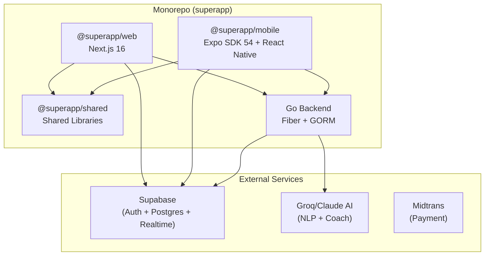
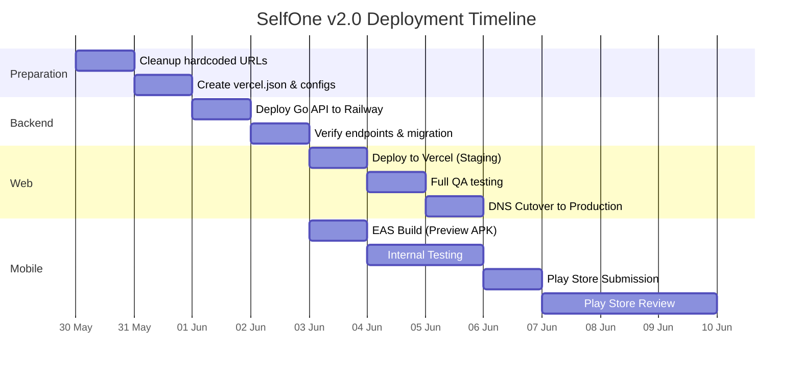

# 🚀 SelfOne v2.0 — Deployment & Transition Plan

Dokumen ini berisi rencana terstruktur untuk men-*deploy* versi terbaru SelfOne (branch `feature/microservices`) ke *production*, menggantikan versi lama yang berjalan di `https://sumonize.my.id` (branch `main`).

---

## Arsitektur Saat Ini



---

## Status Branch

| Branch | Status | Keterangan |
|--------|--------|------------|
| `main` | 🟢 Production | Versi lama, live di `sumonize.my.id` (Web only, tanpa backend Go) |
| `feature/microservices` | 🟡 Development | Versi baru, monorepo + Go backend + Mobile app. **1579 files changed, 42k+ insertions** |
| `dev` | ⚪ Inactive | — |

---

## ⚠️ Masalah Kritis yang Harus Dibenahi Sebelum Deploy

### 1. Hardcoded `localhost:8080` di Web

> [!CAUTION]
> Saat ini ada **7 lokasi** di kode Web yang meng-*hardcode* URL `http://localhost:8080`. Ini PASTI gagal di production.

| File | Line(s) |
|------|---------|
| `web/app/squads/page.js` | 20, 44 |
| `web/components/QuickCapture.js` | 43 |
| `web/components/AICoachPopup.js` | 15, 53 |
| `web/components/CrossModuleInsights.js` | 17, 35 |

**Solusi:** Buat environment variable `NEXT_PUBLIC_API_URL` dan ganti semua hardcoded URL.

### 2. Mobile `API_URL` Masih Pakai Cloudflare Tunnel

File `mobile/lib/config.ts` line 14 saat ini fallback ke:
```
https://sample-toward-driven-resolve.trycloudflare.com/api/v1
```
Ini adalah tunnel development yang tidak stabil. Harus diganti ke URL production backend.

### 3. Supabase Credentials

Pastikan Supabase project yang digunakan di production sama antara Web dan Mobile, atau jika berbeda, data harus dimigrasikan.

---

## Rencana Deployment per Komponen

### 🔵 Komponen 1: Go Backend API

**Target Host:** Railway / Render / Fly.io / VPS (rekomendasi: **Railway** karena native Docker support + auto-deploy dari Git)

**Langkah:**

1. **Siapkan PostgreSQL Production**
   - Gunakan Supabase Postgres yang sudah ada (atau Railway Postgres jika ingin terpisah)
   - Jalankan auto-migration GORM saat startup (sudah bawaan)

2. **Set Environment Variables di Host**
   ```env
   PORT=8080
   DATABASE_URL=postgres://...@supabase-pooler/postgres
   JWT_SECRET=<production-secret-yang-kuat>
   GROQ_API_KEY=<production-key>
   CLAUDE_API_KEY=<production-key>
   ```

3. **Deploy via Docker**
   - Dockerfile sudah siap di `backend/Dockerfile`
   - Railway/Render bisa auto-detect Dockerfile
   - Atau push manual: `docker build -t selfone-api . && docker push`

4. **Custom Domain (opsional)**
   - Misalnya: `api.sumonize.my.id`
   - Atau gunakan domain default dari Railway (`.railway.app`)

5. **Validasi:**
   ```bash
   curl https://api.sumonize.my.id/api/v1/parse -X POST \
     -H "Content-Type: application/json" \
     -d '{"text": "test"}'
   ```

---

### 🟢 Komponen 2: Web (Vercel)

**Target Host:** Vercel (optimal untuk Next.js)

**Langkah:**

1. **Konfigurasi Vercel untuk Monorepo**
   - Root Directory: `web`
   - Build Command: `cd .. && pnpm install && pnpm build:web`
   - Output Directory: `web/.next`
   - Framework Preset: **Next.js**
   - Atau buat `vercel.json` di root:

   ```json
   {
     "buildCommand": "pnpm build:web",
     "outputDirectory": "web/.next",
     "installCommand": "pnpm install",
     "framework": "nextjs",
     "ignoreCommand": "git diff HEAD^ HEAD --quiet -- web/ shared/"
   }
   ```

2. **Environment Variables di Vercel Dashboard**
   ```env
   NEXT_PUBLIC_API_URL=https://api.sumonize.my.id
   NEXT_PUBLIC_SUPABASE_URL=https://xxx.supabase.co
   NEXT_PUBLIC_SUPABASE_ANON_KEY=eyJ...
   NEXT_PUBLIC_ENCRYPTION_KEY=<production-encryption-key>
   NEXT_PUBLIC_MIDTRANS_CLIENT_KEY=Mid-client-xxx
   NEXT_PUBLIC_MIDTRANS_PRODUCTION=true
   MIDTRANS_SERVER_KEY=Mid-server-xxx
   ```

3. **Custom Domain**
   - Hubungkan `sumonize.my.id` ke project Vercel baru
   - Vercel akan otomatis handle SSL certificate

4. **Verifikasi Build**
   ```bash
   cd web && pnpm build
   ```

---

### 🟣 Komponen 3: Mobile (Play Store / App Store via EAS)

**Target:** Google Play Store (Android) + Apple App Store (iOS)

**Langkah:**

1. **Konfigurasi EAS Secrets**
   ```bash
   cd mobile
   eas secret:create --name EXPO_PUBLIC_API_URL --value https://api.sumonize.my.id/api/v1
   eas secret:create --name EXPO_PUBLIC_SUPABASE_URL --value https://xxx.supabase.co
   eas secret:create --name EXPO_PUBLIC_SUPABASE_ANON_KEY --value eyJ...
   ```

2. **Build APK/AAB untuk Android**
   ```bash
   # Preview build (internal testing)
   pnpm build:preview

   # Production build (untuk Play Store)
   pnpm build:android
   ```

3. **Build untuk iOS**
   ```bash
   pnpm build:ios
   ```
   > [!IMPORTANT]
   > Untuk iOS, lo butuh:
   > - Apple Developer Account ($99/tahun)
   > - Provisioning Profile & Certificates (EAS bisa auto-generate)
   > - App Store Connect setup

4. **Submit ke Store**
   ```bash
   # Android → Google Play Console
   pnpm submit:android

   # iOS → App Store Connect
   pnpm submit:ios
   ```

5. **OTA Updates (Tanpa Re-submit ke Store)**
   ```bash
   # Setelah app terpasang, update JS bundle langsung via EAS Update
   pnpm update
   ```

---

## 📋 Fase Transisi dari Versi Lama ke Baru

### Fase 0: Pre-Deployment Prep (1-2 hari)

- [ ] **Bersihkan hardcoded URLs** — Ganti semua `localhost:8080` ke `process.env.NEXT_PUBLIC_API_URL`
- [ ] **Buat `vercel.json`** untuk konfigurasi monorepo
- [ ] **Update `mobile/lib/config.ts`** fallback URL ke production
- [ ] **Audit environment variables** — Pastikan semua `.env.example` lengkap
- [ ] **Test build lokal** — `pnpm build:web` harus sukses tanpa error
- [ ] **Backup Supabase data** — Export data production lama

### Fase 1: Deploy Backend (1 hari)

- [ ] Deploy Go API ke Railway/Render
- [ ] Konfigurasi `DATABASE_URL` mengarah ke Supabase Postgres production
- [ ] Verifikasi auto-migration GORM berjalan (tabel baru: `squads`, `challenges`, `context_snapshots`, dll)
- [ ] Test semua endpoint: `/parse`, `/insights`, `/coach`, `/social/*`
- [ ] Setup monitoring (Railway built-in logs atau Sentry)

### Fase 2: Deploy Web ke Vercel — Staging (1 hari)

- [ ] Deploy ke Vercel dengan domain **staging** dulu (misal: `staging.sumonize.my.id` atau `selfone-v2.vercel.app`)
- [ ] Verifikasi semua fitur Phase 1-6 berjalan
- [ ] Test Cloud Sync: Push & Pull
- [ ] Test E2E Encryption: Set password → Sync → Verify encrypted payload di Supabase
- [ ] Test Payment Gateway Midtrans

### Fase 3: Migrasi Data User Lama (1 hari)

> [!WARNING]
> Ini adalah langkah paling kritis. User lama punya data di `localStorage` dengan format versi lama.

**Strategi Migrasi:**

```
User buka versi baru → Deteksi data lama di localStorage → Auto-migrate format
```

- Data lama (branch `main`) disimpan di `localStorage` dengan key pattern: `{userId}_superapp_{module}`
- Data baru (branch `feature/microservices`) menggunakan pattern yang sama via `localforage` dengan migration layer
- **Tidak perlu migrasi eksplisit** karena `web/lib/storage.js` sudah punya `migrateFromLocalStorage()` yang otomatis membaca data lama dari `localStorage` dan memindahkannya ke `localforage`

**Yang perlu dicek:**
- Apakah ada perubahan *schema* data (misal: field baru di Tasks/Habits)?
- Jika ada, buat *migration script* di `storage.js` yang menambahkan field default

### Fase 4: Cutover ke Production (1 hari)

- [ ] **Pointing DNS:** Arahkan `sumonize.my.id` dari hosting lama ke Vercel
- [ ] Verifikasi SSL certificate aktif
- [ ] Monitor error logs selama 24 jam pertama
- [ ] Pastikan Cloud Sync masih jalan untuk user yang sudah punya data di Supabase

### Fase 5: Rilis Mobile App (3-7 hari)

- [ ] Build production APK/AAB via EAS
- [ ] Upload ke Google Play Console (Internal Testing track dulu)
- [ ] Isi semua metadata Play Store (screenshots, deskripsi, privacy policy)
- [ ] Promosikan ke Production track setelah testing OK
- [ ] *(Opsional)* Submit ke Apple App Store

---

## 🔧 Perubahan Kode yang Diperlukan

### A. Buat Environment Variable untuk API URL di Web

**File baru: `web/lib/apiConfig.js`**
```javascript
export const API_URL = process.env.NEXT_PUBLIC_API_URL || 'http://localhost:8080/api/v1';
```

Kemudian ganti semua hardcoded fetch di 4 file tersebut.

### B. Update `vercel.json` (di root monorepo)

```json
{
  "$schema": "https://openapi.vercel.sh/vercel.json",
  "buildCommand": "pnpm build:web",
  "outputDirectory": "web/.next",
  "installCommand": "pnpm install",
  "framework": "nextjs"
}
```

### C. Update `next.config.mjs` untuk production build

```javascript
const nextConfig = {
  transpilePackages: ['@superapp/shared'],
  output: 'standalone', // Opsional, berguna untuk Docker deploy
};
```

---

## 🕐 Timeline Ringkasan



**Total estimasi: ~10-14 hari dari sekarang hingga semua live.**

---

## Open Questions

> [!IMPORTANT]
> Pertanyaan ini perlu lo jawab sebelum kita eksekusi:

1. **Backend hosting:** Lo prefer Railway, Render, Fly.io, atau VPS sendiri? (Rekomendasi: Railway karena paling simpel untuk Go + Docker)

2. **Domain API:** Mau pakai subdomain `api.sumonize.my.id`, atau domain terpisah?

3. **iOS:** Lo punya Apple Developer Account? Kalau belum, kita fokus Android dulu?

4. **Play Store Account:** Lo sudah punya Google Play Console ($25 one-time fee)?

5. **Supabase project:** Tetap pakai project yang sama dengan versi lama, atau bikin project baru untuk v2?

6. **Fase cutover:** Mau langsung full switch (matikan versi lama), atau mau parallel running dulu beberapa hari?
