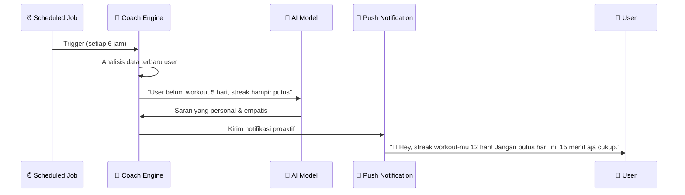

# 🔍 Analisis Strategis: Menjadikan SelfOne "Tidak Biasa"

Dokumen ini adalah analisis jujur dari codebase SuperApp (SelfOne) yang telah saya pelajari secara menyeluruh — beserta rekomendasi konkret untuk menjadikannya benar-benar berbeda di pasar yang sudah jenuh.

---

## 💀 Diagnosis Jujur: Mengapa Saat Ini Masih "Biasa"

Sebelum membahas solusi, kita perlu jujur tentang kondisi saat ini:

### 1. Aplikasi Ini Adalah "Feature Aggregator", Bukan Platform Cerdas

Saat ini SelfOne menggabungkan **Tasks + Habits + Finance + Journal + Health + Pomodoro + Reading + Goals** ke dalam satu tempat. Masalahnya: **setiap modul berjalan dalam silo yang terisolasi**. Tidak ada koneksi cerdas antarmodul.

```
KONDISI SAAT INI (Silo Architecture):
┌─────────┐ ┌─────────┐ ┌─────────┐ ┌─────────┐
│  Tasks  │ │ Habits  │ │ Finance │ │ Journal │   ← Semua terpisah
└─────────┘ └─────────┘ └─────────┘ └─────────┘
     ↕             ↕           ↕           ↕
  localStorage  localStorage  localStorage  localStorage
```

**Realita pasar**: User sudah punya Todoist untuk tasks, Habitica untuk habits, Money Lover untuk keuangan. Mengapa mereka harus pindah ke SelfOne kalau SelfOne hanya menggabungkan fitur-fitur itu tanpa nilai tambah?

### 2. AI Integration Masih Sangat Superfisial

Melihat [ai_service.go](file:///Users/user/superapp/backend/internal/usecase/ai_service.go):
- AI hanya dipanggil secara *fire-and-forget* — hasilnya di-`log.Printf` tapi **tidak pernah dikembalikan ke user**.
- Tidak ada tabel `insights` di database untuk menyimpan hasil analisis.
- Prompt yang dikirim sangat generik (`"Berikan analisis singkat dan saran aksi"`).
- Tidak ada *memory* — AI tidak mengingat konteks percakapan atau riwayat user.

Di sisi web, [ProInsights.js](file:///Users/user/superapp/web/components/ProInsights.js) memang menganalisis data keuangan, tapi semuanya **rule-based client-side** (bukan AI sesungguhnya). Ini mudah ditiru kompetitor dalam hitungan hari.

### 3. Gamifikasi Terlalu Sederhana

Sistem di [gamification.js](file:///Users/user/superapp/shared/lib/gamification.js) adalah **XP linear standar**: selesaikan task → dapat 15 XP, tulis jurnal → dapat 10 XP, naik level. 

Hampir setiap aplikasi produktivitas modern sudah memiliki ini (Habitica, Forest, Duolingo). Tidak ada yang unik.

### 4. Fitur Sosial Belum Bermakna

[social.go](file:///Users/user/superapp/backend/internal/domain/social.go) hanya memiliki `Leaderboard` dan `Squad` dengan field `MemberCount`. Squad belum memiliki:
- Shared goals / challenges
- Accountability mechanism  
- Chat atau interaksi antaranggota

### 5. Data Hanya Disimpan, Tidak Dimanfaatkan

[storage.js](file:///Users/user/superapp/shared/lib/storage.js) menyimpan data ke localStorage/AsyncStorage per modul, tapi **tidak pernah ada proses yang menghubungkan data antarmodul** untuk menghasilkan insight yang bermakna.

---

## 🚀 7 Fitur Pembeda yang Akan Membuat SelfOne "Tidak Biasa"

### 1. 🧠 Cross-Module Intelligence Engine (KILLER FEATURE)

**Ini adalah fitur yang TIDAK dimiliki kompetitor manapun.**

Idenya: hubungkan data antarmodul untuk menemukan pola tersembunyi dalam kehidupan user.

```
ARSITEKTUR BARU (Connected Intelligence):
┌─────────┐ ┌─────────┐ ┌─────────┐ ┌─────────┐
│  Tasks  │ │ Habits  │ │ Finance │ │ Journal │
└────┬────┘ └────┬────┘ └────┬────┘ └────┬────┘
     │           │           │           │
     └───────────┴─────┬─────┴───────────┘
                       │
              ┌────────┴────────┐
              │  Intelligence   │
              │     Engine      │  ← BARU: Menghubungkan semua data
              └────────┬────────┘
                       │
              ┌────────┴────────┐
              │  Personal       │
              │  Insight Feed   │  ← Output: insight yang personal & bermakna
              └─────────────────┘
```

**Contoh insight yang dihasilkan:**

| Korelasi | Insight untuk User |
|----------|--------------------|
| Habits ↔ Finance | *"Kamu cenderung overspend Rp 340.000 di hari ketika kamu skip habit 'Meditasi Pagi'. Coba pertahankan habit ini."* |
| Journal sentiment ↔ Health | *"Mood jurnal kamu turun 40% di minggu ketika kamu tidak workout sama sekali. Olahraga 2x seminggu bisa jadi game-changer."* |
| Pomodoro ↔ Tasks | *"Task dengan label 'Design' selesai 3x lebih cepat saat kamu pakai Pomodoro dibanding tanpa. Aktifkan timer otomatis untuk task kategori ini?"* |
| Finance ↔ Calendar | *"Setiap tanggal 25-30 pengeluaranmu naik 60%. Ini pola gajian. Mau saya buatkan budget otomatis?"* |
| Goals ↔ Habits | *"Goal 'Baca 12 buku/tahun' sedang tertinggal. Kamu perlu menambah habit 'Baca 20 menit/hari' untuk catch up."* |

**Implementasi teknis:**
- Tambahkan `CorrelationEngine` di Go Backend yang berjalan sebagai scheduled job (cron setiap malam).
- Engine ini query PostgreSQL untuk data lintas modul per user, lalu kirim ke AI (Groq/Claude) dengan prompt terstruktur yang menjelaskan konteks antarmodul.
- Simpan hasil ke tabel baru `user_insights` dengan kolom `insight_type`, `confidence_score`, `related_modules[]`, `action_suggestion`.
- Tampilkan di dashboard sebagai "Personal Intelligence Feed" yang hidup dan terus berubah.

---

### 2. 🤖 Proactive AI Coach (Bukan Reaktif)

Saat ini AI hanya menganalisis ketika data masuk. Ubah menjadi **coach yang proaktif** — dia yang menghubungi user duluan.

**Konsep "SelfOne Coach":**



**Bedanya dengan reminder biasa:**
- Reminder biasa: *"Waktunya olahraga!"* (generik, sama setiap hari)
- AI Coach: *"Streak 12 hari kamu mengesankan! Tapi saya perhatikan kamu skip 2 hari terakhir kalau hujan. Coba indoor workout hari ini? 🏠"* (personal, kontekstual)

**Implementasi:**
- Buat service `CoachEngine` di backend dengan goroutine scheduler.
- Query pola perilaku user dari PostgreSQL.
- Generate pesan coach menggunakan Groq (cepat) dengan prompt yang menyertakan konteks historis user.
- Kirim melalui push notification (web: Service Worker, mobile: expo-notifications).
- Simpan riwayat coaching ke tabel `coach_messages` untuk building conversational memory.

---

### 3. 👥 Accountability Squads 2.0

Ubah Squad dari sekadar "grup leaderboard" menjadi **mekanisme accountability yang nyata**.

**Fitur baru untuk Squad:**

| Fitur | Deskripsi |
|-------|-----------|
| **Shared Challenges** | Squad bisa buat challenge bersama: "Semua anggota baca 1 buku bulan ini" |
| **Commitment Contracts** | User bisa *stake* token XP mereka. Gagal = kehilangan XP, berhasil = bonus XP |
| **Weekly Check-In** | Setiap Minggu, setiap anggota submit progress report (otomatis dari data modul) |
| **Peer Nudging** | Anggota bisa kirim "nudge" ke teman yang belum selesai habit hari ini |
| **Squad Streak** | Bukan streak individu, tapi streak kolektif — semua anggota harus aktif |

**Domain model baru:**
```go
type Challenge struct {
    ID          uuid.UUID
    SquadID     uuid.UUID
    Title       string
    Type        string    // "habit", "reading", "fitness", etc.
    Target      int       // misal: 30 (hari), 5 (buku), etc.
    StartDate   time.Time
    EndDate     time.Time
    StakeXP     int       // XP yang dipertaruhkan per peserta
}

type ChallengeProgress struct {
    ChallengeID uuid.UUID
    UserID      uuid.UUID
    Current     int
    IsCompleted bool
    UpdatedAt   time.Time
}
```

---

### 4. 🎭 Narrative Gamification (Bukan Sekadar XP)

Ganti sistem "XP → Level → Title" yang generik dengan **narasi pertumbuhan personal** yang membuat user merasa sedang menjalani sebuah perjalanan hidup.

**Konsep "Life Story Arc":**

Alih-alih `Noob → Beginner → Warrior → GIGACHAD`, buat narasi yang bermakna:

```
Chapter 1: "Awakening" (0-100 XP)
  → "Kamu mulai memperhatikan hidupmu. Langkah pertama selalu yang terberat."

Chapter 2: "Building Foundations" (100-300 XP)  
  → "Kebiasaan baik mulai terbentuk. Kamu membangun fondasi."

Chapter 3: "The Grind" (300-600 XP)
  → "Di sinilah kebanyakan orang menyerah. Kamu tidak."

Chapter 4: "Breaking Through" (600-1000 XP)
  → "Perubahan nyata mulai terlihat. Orang-orang di sekitarmu memperhatikan."

...dan seterusnya
```

Setiap chapter memiliki:
- **Cutscene text** yang muncul saat level up (bukan sekadar "Level Up!" popup)
- **Personal milestone recap** yang di-generate AI dari data aktual user
- **Visual character evolution** — avatar yang berubah seiring progress

**Contoh Level Up Moment:**
> *"Chapter 4 Unlocked: Breaking Through 🌅"*
> 
> *"Dalam 2 bulan terakhir, kamu telah menyelesaikan 47 tasks, menulis 12 jurnal, dan menabung Rp 2.3 juta. Streak terlama: 14 hari. Kamu bukan lagi orang yang sama seperti saat mulai. Chapter baru dimulai."*

Ini jauh lebih bermakna daripada *"Selamat! Kamu naik ke Level 4: Hustler 💪"*.

---

### 5. 🔒 Privacy-First Architecture (Competitive Moat)

Di era ketika semua aplikasi mengumpulkan data, jadikan **privasi sebagai fitur premium**.

**Konsep "Your Data, Your Rules":**

| Mode | Deskripsi | Target User |
|------|-----------|-------------|
| **Local-Only** | Semua data di device, zero cloud | Privacy purist |
| **Encrypted Sync** | End-to-end encrypted, server tidak bisa baca | Balanced user |
| **Full Cloud** | Seperti sekarang, untuk convenience | Casual user |

**Implementasi E2E Encryption:**
- Gunakan `crypto-js` (sudah ada di dependencies!) untuk encrypt data sebelum sync.
- Key derivation dari password user — server hanya menyimpan ciphertext.
- Ini membuat SelfOne bisa dengan jujur mengatakan: *"Bahkan kami tidak bisa membaca data Anda"*.

**Mengapa ini penting secara bisnis:**
- Jurnal dan data kesehatan adalah data **sangat sensitif**.
- Kompetitor besar (Notion, Todoist) tidak menawarkan E2E encryption.
- Ini menjadi *trust differentiator* yang sulit ditiru.

---

### 6. 🎨 Adaptive UI: Dashboard yang Berubah Sesuai Konteks

Saat ini dashboard ([page.js](file:///Users/user/superapp/web/app/page.js)) menampilkan semua stats secara statis. Ubah menjadi **kontekstual**:

| Waktu | Dashboard Menampilkan |
|-------|----------------------|
| **Pagi (6-9)** | Morning routine checklist, habit yang harus dilakukan hari ini, motivational quote |
| **Kerja (9-17)** | Task list hari ini, Pomodoro quick-start, focus stats |
| **Sore (17-20)** | Workout reminder, reading progress, finance daily summary |
| **Malam (20-23)** | Journal prompt, reflection on the day, tomorrow's preview |

**Plus: "Smart Widgets"** — modul yang paling sering dipakai user otomatis naik ke atas. Machine learning sederhana berdasarkan usage frequency.

---

### 7. 🎤 Voice-First Capture & Natural Language Input

**Masalah terbesar aplikasi produktivitas: friction saat input data.**

Mengetik detail task, memasukkan transaksi keuangan, menulis jurnal — semua butuh effort. Solusinya:

**Natural Language Processing:**
```
User mengetik: "Habis beli kopi 35rb di Starbucks"
→ Auto-parse: { type: "expense", amount: 35000, category: "food", note: "Starbucks" }

User mengetik: "Besok meeting dengan client jam 2 siang"  
→ Auto-parse: { type: "task", title: "Meeting dengan client", date: "2026-05-30", time: "14:00" }

User mengetik: "Hari ini capek banget tapi berhasil selesaikan proposal"
→ Auto-parse: Journal entry + sentiment: "tired but accomplished" + auto-XP for task
```

**Implementasi:**
- Tambahkan "Quick Capture Bar" di bagian atas dashboard (mirip Spotlight di macOS).
- Kirim input ke Groq API untuk parsing natural language → structured data.
- Otomatis masukkan ke modul yang tepat (Finance/Task/Journal/dll).

---

## 📊 Prioritas Implementasi

```
IMPACT vs EFFORT Matrix:

HIGH IMPACT
    │
    │  ★ Cross-Module Intelligence    ★ AI Coach (Proactive)
    │      [EFFORT: HIGH]                [EFFORT: MEDIUM]
    │
    │  ★ Natural Language Input       ★ Accountability Squads 2.0  
    │      [EFFORT: MEDIUM]              [EFFORT: MEDIUM]
    │
    │  ★ Adaptive Dashboard           ★ Narrative Gamification
    │      [EFFORT: LOW]                 [EFFORT: LOW-MEDIUM]
    │
    │  ★ Privacy-First (E2E)
    │      [EFFORT: HIGH]
    │
LOW IMPACT ────────────────────────────── HIGH EFFORT
```

### Roadmap yang Disarankan:

| Phase | Fitur | Timeline | Alasan |
|-------|-------|----------|--------|
| **Phase 1** | Adaptive Dashboard + Narrative Gamification | 1-2 minggu | Quick win, langsung terasa berbeda |
| **Phase 2** | Natural Language Input (Quick Capture) | 2-3 minggu | Mengurangi friction, meningkatkan daily usage |
| **Phase 3** | Cross-Module Intelligence Engine | 3-4 minggu | **Core differentiator**, butuh backend work |
| **Phase 4** | Proactive AI Coach | 2-3 minggu | Bergantung pada Phase 3 |
| **Phase 5** | Accountability Squads 2.0 | 2-3 minggu | Social loop untuk retention |
| **Phase 6** | Privacy-First E2E Encryption | 3-4 minggu | Long-term trust moat |

---

## 🏗️ Perubahan Teknis yang Dibutuhkan

### Backend (Go)

| Komponen | Perubahan |
|----------|-----------|
| **Domain Models** | Tambah: `Insight`, `CoachMessage`, `Challenge`, `ChallengeProgress`, `UserPreference` |
| **Repositories** | Tambah: `InsightRepository`, `CoachRepository`, `ChallengeRepository` |
| **Usecases** | Tambah: `CorrelationEngine`, `CoachEngine`, `NLPParser` |
| **Delivery** | Tambah: `/api/v1/insights`, `/api/v1/coach/messages`, `/api/v1/challenges`, `/api/v1/parse` |
| **Infrastructure** | Tambah: Cron scheduler (gocron), WebSocket untuk real-time coach messages |
| **AI Service** | Refactor: tambah structured prompts, response parsing, conversation memory |
| **Database** | Tambah tabel: `insights`, `coach_messages`, `challenges`, `challenge_progress` |

### Shared Package

| Komponen | Perubahan |
|----------|-----------|
| **Storage** | Tambah: event bus untuk cross-module data access |
| **Gamification** | Refactor: narrative system dengan chapter-based progression |
| **Cloud Sync** | Tambah: optional E2E encryption layer sebelum sync |
| **NLP Parser** | Baru: client-side NLP untuk offline parsing + API fallback |

### Frontend (Web + Mobile)

| Komponen | Perubahan |
|----------|-----------|
| **Dashboard** | Refactor: time-aware adaptive layout + smart widget ordering |
| **Quick Capture Bar** | Baru: universal input bar dengan NLP |
| **Insight Feed** | Baru: komponen untuk menampilkan cross-module insights |
| **Coach Chat** | Baru: chat-like interface untuk interaksi dengan AI Coach |
| **Squad Detail** | Refactor: tambah challenges, progress tracking, peer nudging |
| **Level Up Modal** | Refactor: narrative cutscene dengan personal recap |

---

## 💡 Satu Kalimat Penutup

> **Aplikasi produktivitas yang laku bukan yang punya fitur terbanyak, tapi yang paling mengerti penggunanya.**

SelfOne punya fondasi teknis yang solid (monorepo, shared code, Go backend dengan AI). Yang kurang adalah **koneksi cerdas antarmodul** dan **personalisasi yang membuat user merasa "aplikasi ini mengerti saya"**.

Fokuslah pada **Cross-Module Intelligence** — itu adalah moat yang sulit ditiru kompetitor karena membutuhkan data dari banyak aspek kehidupan user sekaligus. Tidak ada aplikasi single-purpose (Todoist, Habitica, Money Lover) yang bisa melakukan ini.

---

> [!IMPORTANT]
> Dokumen ini adalah **rekomendasi strategis**. Jika Anda ingin saya mulai mengimplementasikan salah satu fitur di atas, beri tahu saya mana yang menjadi prioritas Anda, dan saya akan membuat implementation plan teknis yang detail.
